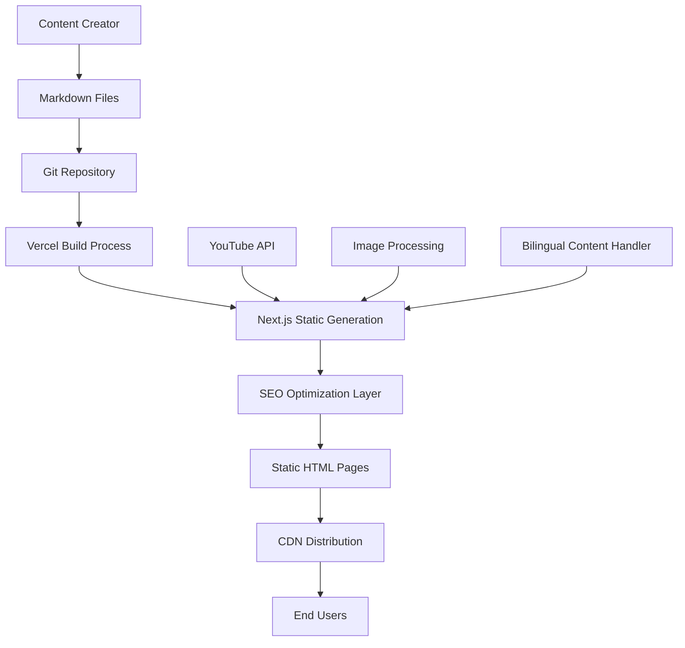

# Design Document

## Overview

The HoloAnima website will be built as a modern, static site using Next.js 14 with App Router, deployed on Vercel for automatic continuous deployment. The architecture centers around a Markdown-to-HTML conversion system that automatically generates SEO-optimized blog posts while maintaining a seamless integration with HoloAnima's YouTube channel.

The system will feature a clean, child-friendly design with robust bilingual support, automated SEO optimization, and a content management workflow that requires minimal technical knowledge from content creators.

## Architecture

### System Architecture Overview



### Technology Stack

- **Frontend Framework**: Next.js 14 with App Router and Static Site Generation (SSG)
- **Styling**: Tailwind CSS for responsive, utility-first styling
- **Markdown Processing**: MDX with custom plugins for enhanced functionality
- **Deployment**: Vercel with automatic Git-based deployments
- **Content Management**: File-based system using Git repository
- **SEO**: Next.js built-in SEO features + custom metadata generation
- **Analytics**: Google Analytics 4 integration
- **Image Optimization**: Next.js Image component with Vercel image optimization

### Content Flow Architecture

1. **Content Input**: Markdown files with YAML front matter placed in `/content/blog/` directory
2. **Processing Pipeline**: Custom MDX plugins parse content and generate metadata
3. **Build Process**: Next.js generates static pages with SEO optimization
4. **Deployment**: Vercel automatically deploys on Git push
5. **Distribution**: Global CDN serves optimized static content

## Components and Interfaces

### Core Components

#### 1. Layout Components

**Header Component**
- Responsive navigation with language toggle
- Logo and branding elements
- Mobile-friendly hamburger menu
- YouTube channel link prominently displayed

**Footer Component**
- Social media links (YouTube, TikTok, Instagram, Twitter)
- Legal pages (Privacy Policy, Terms of Service)
- Newsletter signup form
- Language selector (duplicate for accessibility)

**Navigation Component**
- Home, Videos, Blog, Characters, About Us, Contact
- Breadcrumb navigation for blog posts
- Search functionality (future enhancement)

#### 2. Content Components

**BlogPost Component**
- Automatic SEO metadata injection
- Social sharing buttons
- Related posts suggestions
- YouTube video embedding capability
- Character mention highlighting with links

**CharacterCard Component**
- Character image, name, and description
- Links to related blog posts and videos
- Bilingual content support

**VideoEmbed Component**
- YouTube video integration
- Responsive iframe handling
- Custom play button overlay
- Video metadata display

#### 3. SEO Components

**MetadataGenerator**
- Automatic title generation from H1 tags
- Meta description extraction from content
- Open Graph and Twitter Card generation
- Canonical URL management
- Hreflang tag implementation

**StructuredData Component**
- Article schema for blog posts
- VideoObject schema for embedded content
- Organization schema for brand information
- BreadcrumbList schema for navigation

### API Interfaces

#### Content Management Interface

```typescript
interface BlogPost {
  slug: string;
  title: string;
  description: string;
  content: string;
  publishDate: Date;
  language: 'en' | 'es';
  characters: string[];
  relatedVideos: string[];
  seoMetadata: SEOMetadata;
}

interface SEOMetadata {
  title: string;
  description: string;
  keywords: string[];
  canonicalUrl: string;
  openGraph: OpenGraphData;
  structuredData: StructuredDataObject;
}
```

#### YouTube Integration Interface

```typescript
interface YouTubeVideo {
  videoId: string;
  title: string;
  description: string;
  thumbnailUrl: string;
  publishDate: Date;
  duration: string;
}
```

## Data Models

### Content Structure

```
/content/
├── blog/
│   ├── en/
│   │   ├── snowball-yeti-kindness-lesson.md
│   │   └── pip-penguin-friendship-story.md
│   └── es/
│       ├── snowball-yeti-leccion-bondad.md
│       └── pip-pinguino-historia-amistad.md
├── characters/
│   ├── snowball-the-yeti.md
│   ├── pip-the-penguin.md
│   └── harkin-the-owl.md
└── pages/
    ├── about.md
    └── contact.md
```

### Markdown Front Matter Schema

```yaml
---
title: "How Snowball the Yeti Taught Us About Kindness"
description: "Discover the heartwarming lesson about kindness through Snowball the Yeti's latest adventure"
publishDate: "2024-01-15"
language: "en"
alternateLanguage: "es"
alternateSlug: "snowball-yeti-leccion-bondad"
characters: ["snowball-the-yeti"]
relatedVideos: ["dQw4w9WgXcQ"]
keywords: ["kindness for kids", "moral stories", "yeti adventures"]
category: "moral-lessons"
featured: true
---
```

### Character Data Model

```typescript
interface Character {
  id: string;
  name: string;
  description: string;
  personality: string[];
  lessons: string[];
  imageUrl: string;
  relatedPosts: string[];
  relatedVideos: string[];
  bilingual: {
    en: CharacterContent;
    es: CharacterContent;
  };
}
```

## Error Handling

### Build-Time Error Handling

1. **Markdown Validation**: Validate front matter schema and required fields
2. **Image Processing**: Handle missing images gracefully with placeholder generation
3. **Link Validation**: Check internal links and warn about broken references
4. **SEO Validation**: Ensure all required SEO elements are present

### Runtime Error Handling

1. **404 Pages**: Custom 404 pages with navigation back to main content
2. **Language Fallbacks**: Graceful fallback to default language when content unavailable
3. **Video Embed Failures**: Fallback to static thumbnails when YouTube embeds fail
4. **Performance Monitoring**: Error tracking and performance monitoring integration

### Content Validation Pipeline

```typescript
interface ContentValidator {
  validateFrontMatter(content: string): ValidationResult;
  validateImages(content: string): ValidationResult;
  validateInternalLinks(content: string): ValidationResult;
  validateSEORequirements(metadata: SEOMetadata): ValidationResult;
}
```

## Testing Strategy

### Unit Testing

- **Component Testing**: React Testing Library for all UI components
- **Utility Function Testing**: Jest for SEO generation, content parsing
- **Markdown Processing**: Test MDX plugins and content transformation
- **Bilingual Logic**: Test language switching and hreflang generation

### Integration Testing

- **Build Process**: Test complete Markdown-to-HTML pipeline
- **SEO Generation**: Validate generated metadata and structured data
- **YouTube Integration**: Test video embedding and API interactions
- **Responsive Design**: Cross-device and cross-browser testing

### Performance Testing

- **Core Web Vitals**: Lighthouse CI integration for performance monitoring
- **Image Optimization**: Test image loading and optimization
- **Bundle Size**: Monitor JavaScript bundle size and loading performance
- **SEO Auditing**: Automated SEO audits in CI/CD pipeline

### Content Testing

- **Markdown Rendering**: Test various Markdown syntax combinations
- **Bilingual Content**: Test language switching and content parity
- **Character Integration**: Test character mentions and linking
- **Video Embeds**: Test YouTube integration and responsive behavior

## Implementation Phases

### Phase 1: Core Infrastructure
- Next.js project setup with TypeScript
- Basic layout components and routing
- Markdown processing pipeline
- Vercel deployment configuration

### Phase 2: Content Management
- Blog post generation from Markdown
- SEO metadata automation
- Image processing and optimization
- Basic responsive design

### Phase 3: Bilingual Support
- Hreflang implementation
- Language switching functionality
- Bilingual content routing
- Translation workflow setup

### Phase 4: Advanced Features
- Character pages and integration
- YouTube API integration
- Advanced SEO features (structured data)
- Analytics and monitoring

### Phase 5: Optimization & Polish
- Performance optimization
- Advanced error handling
- Content validation pipeline
- User experience enhancements

## Security Considerations

### Content Security
- Input sanitization for Markdown content
- XSS prevention in dynamic content rendering
- Safe HTML generation from Markdown

### Deployment Security
- Environment variable management
- Secure API key handling
- HTTPS enforcement
- Content Security Policy headers

### Data Privacy
- GDPR-compliant analytics implementation
- Cookie consent management
- Privacy policy integration
- Data minimization practices

## Performance Optimization

### Static Generation Benefits
- Pre-rendered HTML for instant loading
- CDN distribution for global performance
- Minimal JavaScript for core functionality
- Optimized images with Next.js Image component

### SEO Performance
- Server-side rendering for search engines
- Optimized meta tags and structured data
- Fast loading times for better rankings
- Mobile-first responsive design

### Content Delivery
- Vercel Edge Network for global distribution
- Image optimization and WebP conversion
- Gzip compression for text assets
- Browser caching strategies